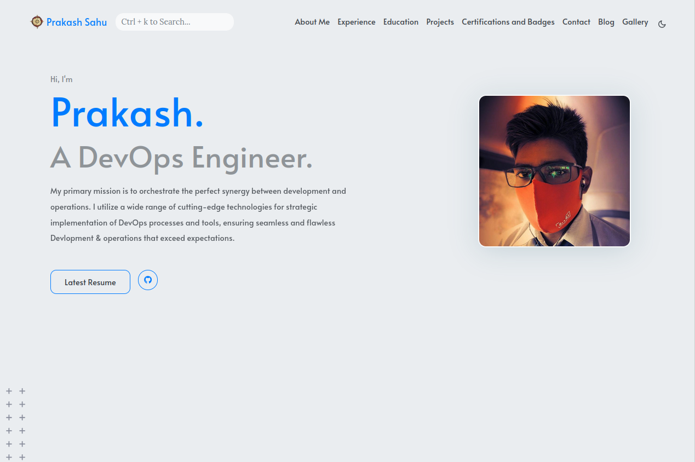
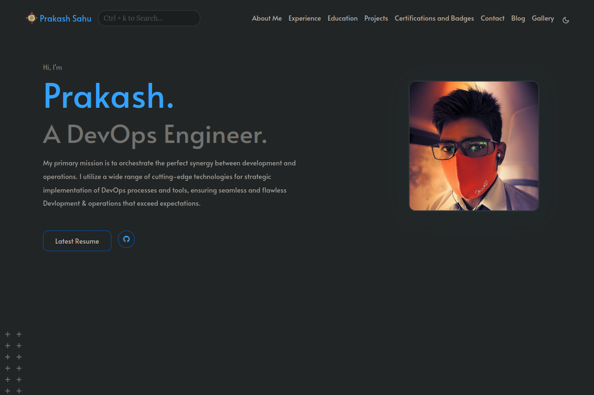

# Prakash's Portfolio

### You can See the portfolio here [Zaphkiel](https://zaphkiel.netlify.app/) 

This is my personal portfolio website built using Hugo, a fast and flexible static site generator. The site showcases my skills, projects, and experiences in the field of software development and engineering.

## Features
- **Responsive Design**: The site is designed to be fully responsive, ensuring a great user experience on all devices.
- **Image Gallery**: A dedicated gallery page to showcase images related to my work and interests.
- **Rich Content Support**: The site supports various rich content formats including Gists, Tweets, Vimeo, and YouTube embeds.
- **Custom Shortcodes**: Utilizes custom shortcodes for responsive images and other content enhancements.
- **Netlify Deployment**: The site is deployed on Netlify, providing continuous deployment and hosting capabilities.
- **GitHub Actions**: Automated workflows for building and deploying the site using GitHub Actions.
- **SEO Optimized**: The site is optimized for search engines with proper metadata and descriptions.
- **Dark Mode Support**: The site supports dark mode for better readability in low-light conditions.

## Technologies Used
- **Hugo**: Static site generator used to build the site.
- **Go**: The primary programming language for Hugo and some custom functionalities.
- **HTML/CSS**: For structuring and styling the site.
- **JavaScript**: For interactive elements and enhancements.
- **Netlify**: For hosting and continuous deployment.
- **GitHub Actions**: For automating the build and deployment process.

## Installation and Setup
To run this portfolio locally, follow these steps:
1. **Clone the Repository**:
   ```bash
   $ git clone --recurse-submodules https://github.com/Prakash4844/My-Portfolio.git
   ```

2. **Navigate to the Project Directory**:
   ```bash
    $ cd My-Portfolio
    ```

3. **Install Hugo**:
    - Follow the [Hugo installation guide](https://gohugo.io/getting-started/installing/) to install Hugo on your system.
    - This project uses Hugo version 0.110.0, so ensure you have that version insatalled.
    - You can check your Hugo version by running:
    ```bash
    $ hugo version
    ```
4. **Run the Development Server**:
5. ```bash
   $ hugo server -D
   ```
   This will start a local development server at `http://localhost:1313`.

6. **Open Your Browser**:
7. Navigate to `http://localhost:1313` to view the portfolio site.

## Building the Site
To build the site for production, run the following command:
```bash
$ hugo -D
```
This will generate the static files in the `public` directory.

Netlify Status: [](https://app.netlify.com/sites/zaphkiel/deploys)

[](https://github.com/Prakash4844/My-Portfolio/actions/workflows/hugo.yml)




---


